<!-- TOC -->

- [manim基础教程](#manim基础教程)
    - [1. 文件的执行](#1-文件的执行)
        - [1.1 保存为视频并立即播放](#11-保存为视频并立即播放)
        - [1.2 保留帧](#12-保留帧)
        - [1.3 视频尺寸](#13-视频尺寸)
        - [1.4 视频通道](#14-视频通道)
        - [1.5 保留进度显示条](#15-保留进度显示条)
        - [1.6 从某一个动画状态（animation）开始存为视频](#16-从某一个动画状态animation开始存为视频)
    - [2. 显示操作](#2-显示操作)
        - [2.1 基本步骤（以`TextMobject`为例）](#21-基本步骤以textmobject为例)
        - [2.5 位置相关的函数](#25-位置相关的函数)
            - [2.5.1 `to_edge()`和`to_corner()`](#251-to_edge和to_corner)
            - [2.5.2 `move_to()`](#252-move_to)
            - [2.5.3 `next_to()`](#253-next_to)
            - [2.5.4 `shift()`](#254-shift)
            - [2.5.5 `rotate()`](#255-rotate)
            - [2.5.6 `flip()`](#256-flip)
        - [2.6 播放动画](#26-播放动画)
            - [2.6.1 `play()`](#261-play)
                - [2.6.1.1 显示动画函数SomePlayMethods](#2611-显示动画函数someplaymethods)
                - [2.6.1.2 `run_time`](#2612-run_time)
            - [2.6.2 `add()`](#262-add)
            - [2.6.3 `wait()`](#263-wait)
            - [2.6.4 `remove()`](#264-remove)
        - [2.7 设置颜色](#27-设置颜色)
        - [2.8 缩放大小](#28-缩放大小)
        - [2.9 同步播放动画](#29-同步播放动画)
    - [3. text数组](#3-text数组)
    - [4. 基础动画类 `Scene`](#4-基础动画类-scene)
    - [5. 二维坐标类 `GraphScene`](#5-二维坐标类-graphscene)
        - [5.1 `setup_axes()`](#51-setu_paxes)
        - [5.2 `get_graph()`](#52-get_graph)
        - [5.3 `coords_to_point()`](#53-coords_to_point)
        - [5.4 `point_to_coords()`](#54-point_to_coords)
        - [5.5 `get_graph_label()`](#55-get_graph_label)
        - [5.6 `get_vertical_line_to_graph()`](#56-get_vertical_line_to_graph)
        - [5.7 `get_vertical_lines_to_graph()`](#57-get_vertical_lines_to_graph)
        - [5.8 `改变坐标标签的颜色](#58-改变坐标标签的颜色)
    - [6. 文本类 `TextMobject`](#6-文本类-textmobject)
    - [7. LaTeX文本类 `TexMobject`](#7-latex文本类-texmobject)
    - [8. 二维图形类](#8-二维图形类)
        - [8.1 点 `Dot`](#81-点dot)
        - [8.2 圆形 `Circle`](#82-圆形circle)
        - [8.3 环 `Annulus`](#83-环annulus)
        - [8.4 长方形 `Rectangle`](#84-长方形rectangle)
        - [8.5 方形 `Square`](#85-方形square)
        - [8.6 椭圆 `Ellipse`](#86-椭圆ellipse)
        - [8.7 弧 `Arc`](#87-弧arc)
        - [8.8 线 `Line`](#88-线line)
    - [9. 三维图形类](#9-三维图形类)
        - [9.1 球 `Sphere`](#91-球-sphere)
        - [9.2 立方 `Cube`](#92-立方-cube)
        - [9.3 棱柱 `Prism`](#93-棱柱prism)
        - [9.4 参数曲面 `ParametricSurface`](#94-参数曲面-parametricsurface)
        - [9.5 参数曲线 `ParametricFunction`](#95-参数曲线-parametricfunction)
    - [10. 群组类 `VGroup`](#10-群组类vgroup)
        - [10.1 `arrange()`](#101-arrange)
    - [11. 相机参数](#11-相机参数)
        - [11.1 `set_camera_orientation`](#111-set_camera_orientation)
        - [11.2 `move_camera`](#112-move_camera)
        - [11.3 `set_to_default_angled_camera_orientation`](#113-set_to_default_angled_camera_orientation)
        - [11.4 `add_fixed_in_frame_mobjects`](#114-add_fixed_in_frame_mobjects)
    - [12. 坐标系类](#12-坐标系类)
        - [12.1 坐标系抽象类 `CoordinateSystem`](#121-坐标系抽象类-coordinatesystem)
        - [12.2 二维坐标类 `Axes`](#122-二维坐标类-axes)
        - [12.3 三维坐标系类 `ThreeDAxes`](#123-三维坐标系类-threedaxes)
        - [12.4 `NumberPlane`](#124-numberplane)
        - [12.5 `ComplexPlane`](#125-complexplane)
    - [附录A：常见的常数](#附录a常见的常数)
        - [1. 颜色](#1-颜色)
        - [2. 方向](#2-方向)
        - [3. 角度](#3-角度)

<!-- /TOC -->
# manim基础教程

注意：  

1. 本文参考YouTube主Theorem of Beethoven的视频与代码然后自己继续研究得到的，有些图片是ta视频截图得到的，可以说是他的教程文字化后的汉化版，根据GitHub主页，他来自墨西哥国立自治大学，感谢外国大佬的力量，除了自己写的部分的代码，有些代码来自TA的视频与GitHub，其人[GitHub主页](https://github.com/Elteoremadebeethoven)，大家有条件可以支持一下他的YouTube  
2. 本人将于2019年9月2日开学，到时候可能忙于学业，不能做到跟进视频更新教程，其实目前教程已经大概涵盖70%的东西，到后面主要是自己读源代码自己分析，python基础很重要，有时间我还是会尽量更新的  
3. 此教程虽在开源社区，但是请勿未经我允许转载，希望大家能共同维护个人劳动成果与开源精神
4. 如果文档有错误或漏洞，或者有问题，欢迎在issue中提出，大家一起讨论，共同创建良好的学习环境

## 1. 文件的执行

**命令行执行：`python -m manim \path\to\yourfile.py [className] [-params]`**

```text
usage: manim.py [-h] [-p] [-w] [-s] [-l] [-m] [--high_quality] [-g] [-i] [-f]
                [-t] [-q] [-a] [-o FILE_NAME] [-n START_AT_ANIMATION_NUMBER]
                [-r RESOLUTION] [-c COLOR] [--sound] [--leave_progress_bars]
                [--media_dir MEDIA_DIR]
                [--video_dir VIDEO_DIR | --video_output_dir VIDEO_OUTPUT_DIR]
                [--tex_dir TEX_DIR] [--livestream] [--to-twitch]
                [--with-key TWITCH_KEY]
                [file] [scene_names [scene_names ...]]

positional arguments:
  file                  path to file holding the python code for the scene
  scene_names           Name of the Scene class you want to see

optional arguments:
  -h, --help            show this help message and exit
  -p, --preview         Automatically open the saved file once its done
  -w, --write_to_movie  Render the scene as a movie file
  -s, --save_last_frame  Save the last frame
  -l, --low_quality     Render at a low quality (for faster rendering)
  -m, --medium_quality  Render at a medium quality
  --high_quality        Render at a high quality 
  -g, --save_pngs       Save each frame as a png  
  -i, --save_as_gif     Save the video as gif
  -f, --show_file_in_finder Show the output file in finder  
  -t, --transparent     Render to a movie file with an alpha channel  
  -q, --quiet
  -a, --write_all       Write all the scenes from a file
  -o FILE_NAME, --file_name FILE_NAME  Specify the name of the output file, ifit should be
                        different from the scene class name
  -n START_AT_ANIMATION_NUMBER, --start_at_animation_number     START_AT_ANIMATION_NUMBER
                        Start rendering not from the first animation,   butfrom another, specified by its index. If you passin two comma separated values, e.g. "3,6", it will end the rendering at the second value
  -r RESOLUTION, --resolution RESOLUTION Resolution, passed as "height,width"
  -c COLOR, --color COLOR  Background color
  --sound               Play a success/failure sound
  --leave_progress_bars Leave progress bars displayed in terminal
  --media_dir MEDIA_DIR directory to write media 
  --video_dir VIDEO_DIR directory to write file tree for video
  --video_output_dir VIDEO_OUTPUT_DIR  directory to write video
  --tex_dir TEX_DIR     directory to write tex
  --livestream          Run in streaming mode
  --to-twitch           Stream to twitch
  --with-key TWITCH_KEY 	Stream key for twitch
```

### 1.1 **保存为视频并立即播放**

参数 `-p` 表示预览，不加分辨率选项默认使用最高画质(1440P60)

如果有多个绘图类会出现列表让你选择

也可以直接指定类名(示例为Example类)生成对应的类名的视频

+ fps = 15,宽854，高480 (480P15)：

  ```bash
  python -m manim \path\to\yourfile.py Example -pl
  ```

+ fps = 30,宽1280，高720 (720P30)：

  ```bash
  python -m manim \path\to\yourfile.py Example -pm
  ```
  
+ fps = 60,宽1920，高1080 (1080P60):

  ```bash
  python -m manim \path\to\yourfile.py Example -p --high_quality
  ```

+ fps = 60,宽2560，高1440 (1440P60)：

  ```bash
  python -m manim \path\to\yourfile.py Example -pw
  ```

### 1.2 **保留帧**

`-s`保留最后一帧

当有多个类的时候会出现选择项让你选择保留哪几个绘图类的最后一帧

+ 保留最后一帧并立即查看：

	```bash
	python -m manim \path\to\yourfile.py Example -ps
	```

+ 保留全部绘图类为视频：

  ```bash
  python -m manim \path\to\yourfile.py Example -al
  python -m manim \path\to\yourfile.py Example -am
  python -m manim \path\to\yourfile.py Example -aw
  ```

+ 保留全部绘图类最后一帧：

  ```bash
  python -m manim \path\to\yourfile.py Example -as
  ```

### 1.3 **视频尺寸**

`-r HEIGHT WIDTH`

+ 高度500 宽度600

  ```bash
  python -m manim \path\to\yourfile.py Example -pr 500 600
  ```

+ 默认为16/9因此默认可以仅设置高度不需要设置宽度

  高度为500的视频：

  ```bash
  python -m manim \path\to\yourfile.py Example -pr 500
  ```

### 1.4 **视频通道**

`-t, --transparent` 生成的视频带有alpha通道（即透明背景），扩展名为`.mov`

### 1.5 **保留进度显示条**

`--leave_progress_bars`:

```
$ python -m manim \path\to\yourfile.py Example -pl --leave_progress_bars
Media will be written to ./media\. You can change this behavior with the --media_dir flag.
Animation 0: WriteTextMobject, etc.: 100%|############################################| 15/15 [00:00<00:00, 32.48it/s] 

File ready at \path\to\video.mp4

Played 2 animations
```

### 1.6 从某一个动画状态（animation）开始存为视频

`-n START_AT_ANIMATION_NUMBER, --start_at_animation_number START_AT_ANIMATION_NUMBER`

不是从第一个动画开始渲染，而是从索引指定的另一个动画开始渲染。 如果您传入两个逗号分隔值，例如 “3,6”，它将以第二个值渲染

```python
class ShowGraph(Scene): 
    def construct(self): 
        print("dot = Dot()")
        dot = Dot()
        self.wait(2)

        print("dot.to_edge(UL)")
        dot.to_edge(UL)
        self.play(FadeIn(dot))
        self.wait(2)

        print("text = TextMobject(\"text\")")
        text = TextMobject("text")
        self.wait(2)

        print("text.to_corner(UP)")
        text.to_corner(UP)
        self.play(Write(text))
        self.wait(2)
```

不加起始渲染运行如下：

```text
$ python -m manim .\1_text_format.py ShowGraph -pl --leave_progress_bars      
Media will be written to ./media\. You can change this behavior with the --media_dir flag.
dot = Dot()
dot.to_edge(UL)
Animation 1: FadeInDot: 100%|############################################################| 15/15 [00:00<00:00, 64.27it/s] 
text = TextMobject("text")
text.to_corner(UP)
Animation 4: WriteTextMobject: 100%|#####################################################| 15/15 [00:00<00:00, 39.79it/s] 

File ready at ...\manim\media\videos\1_text_format\480p15\ShowGraph.mp4

Played 6 animations
```

增加起始渲染：

从刚才的没有渲染的输出可以看出Animation1是`dot.to_edge(UL)`后的`FadeIn(dot)`动画，所以如果`-n 2`则从Animation2开始，所以开始dot就已经显示在屏幕上面了

```text
$ python -m manim .\1_text_format.py ShowGraph -pl -n 2 --leave_progress_bars
Media will be written to ./media\. You can change this behavior with the --media_dir flag.
dot = Dot()
dot.to_edge(UL)
Animation 1: FadeInDot: 100%|############################################################| 15/15 [00:00<00:00, 84.02it/s] 
text = TextMobject("text")
text.to_corner(UP)
Animation 4: WriteTextMobject: 100%|#####################################################| 15/15 [00:00<00:00, 58.52it/s] 

File ready at ...\manim\media\videos\1_text_format\480p15\ShowGraph.mp4

Played 6 animations
```

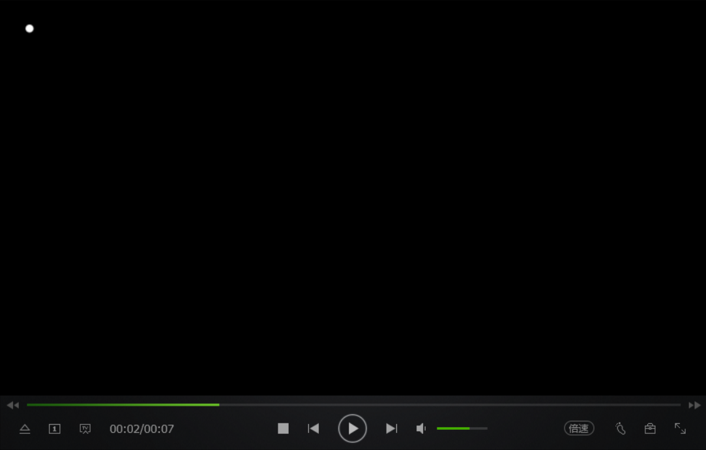

其他的参数不一一介绍，自行查看英文说明

### 1.7 默认显示进度条

默认设置在`manimlib/config.py`，`manimlib/extract_secne.py`与`manimlib/scene.py`里进行定义，可以修改该文件进行修改默认配置,注意因为修改源码所以要小心

例如：在上面的三个文件里：

将里面所有的`--leave_progress_bars`和`leave_progress_bars`修改为`--remove_progress_bars`与`remove__progress_bars`,同时将

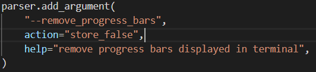

此处的action改成不显示

这样如果加上`--remove_progress_bars`就不会显示进度条了，而默认是显示进度条的

### 1.8 改变视频存放位置

改变`manimlib/constants.py`中的：

```python
if not os.path.isdir(MEDIA_DIR):
    MEDIA_DIR = "./media" 
```

 改`./media`为你想要存放的位置

### 1.9 存为gif

使用 `-i` 选项来导出gif文件，但是目前这个功能被删除掉了，可以按照[这里](https://manim.ml/problems/v2.3.html#q16-gif)更改回去

## 2. 显示操作

### 2.1 基本步骤（以`TextMobject`为例）

```python
from manimlib.imports import *

class WriteText(Scene): 
    def construct(self): 
        text = TextMobject("A Text")
        text.to_edge(UP)
        text.move_to(1 * UP + 0.1 * RIGHT)
        self.play(SomeWriteMethod(text), run_time=seconds)
        self.wait(seconds)
        self.remove(text)
```

### 2.5 位置相关的函数

#### **2.5.1** `to_edge()`和`to_corner()`

**`someObject.to_edge(上下左右四个方向, buff=number)`**

**`someObject.to_corner(左上左下右上右下四个方向, buff=number)`**

`to_edge`参数可以是**任意方向**(方向有哪些见附录中方向常数列表)以及它们的线性组合，如**0.1\*RIGHT+0.2\*UP**，`buff` 两者的边缘的距离

`to_corner`仅接受组合方向**UR，UL，DR，DL**

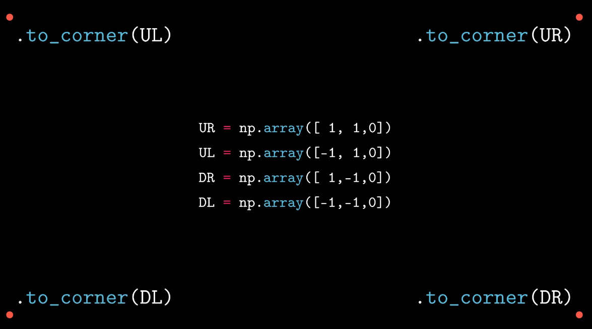

+ 如果没有`to_edge`和`to_center`默认为中间（**ORIGIN**）
+ **`someObject.to_edge(UP + RIGHT)`**完全等效于**`someObject.to_corner(UR)`**,其余四个方向同理

#### 2.5.2 `move_to()`

**`someObject.move_to(DIRECTION的线性组合 or numpy的向量)`**

在当前位置移动到对应的位置

参数可以是**UP，DOWN，LEFT，RIGHT等**的倍数，可以非整数，单位宽度大概是4倍默认字体的行高，**下面只要跟这八个个固定值有关的均是如此**

```python
someObject.move_to(UP + 2 * RIGHT)
```

参数也可以是numpy向量：

```python
vec = np.array([1, 2, 0])
someObject.move_to(vec)
```

因为图案的位置向量可以由`get_center`得到，所以可以如下操作：

```python
someObject.move_to(someObject2.get_center() + 2 * RIGHT)
```

参数还可以是另外一个图案，表示的位置是该图案的几何中心：

```python
someObject.move_to(someObject2)
```

#### 2.5.3 `next_to()`

**`someObject1.next_to(someObject2, DIRECTION, buff=number)`** 

someObject1对于someObject2的相对位置

与`move_to`的区别在于，`next_to`表示的是边界的距离，而不是中心距离

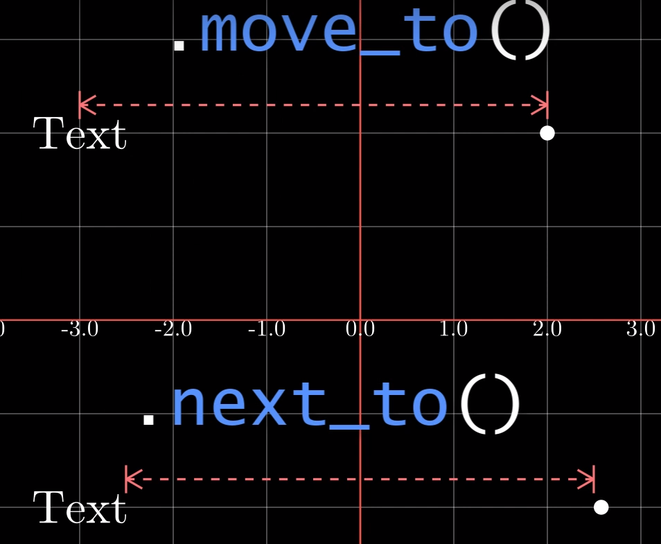

如：`text1.next_to(text2, LEFT, buff=2)` ：


#### 2.5.4 `shift()`

**`someObject.shift(DIRECTION * number)`：**

自己垂直方向平移

#### 2.5.5 `rotate()`

**`someObject.rotate(PI*number 或者 number，point)`：** 

逆时针旋转

如果相对图案为空，则自旋

如：

```python
class RotateObject(Scene):
    def construct(self):
        textM = TextMobject("Text")
        textC = TextMobject("Reference text")
        textM.shift(UP)
        textM.rotate(PI/4) 
        self.play(Write(textM), Write(textC))
        self.wait(2)
```


否则相对 相对图案旋转：

```python
class RotateObject(Scene):
    def construct(self):
        textM = TextMobject("Text")
        textC = TextMobject("Reference text")
        textM.rotate(PI/4, textC) 
        self.play(Write(textM), Write(textC))
        self.wait(2)
```

#### 2.5.6 `flip()`

**`someObject.flip(DIRECTION)`：**

按照矢量量方向翻转180度，方向遵循右手定则。

如`text.flip(UP)`：

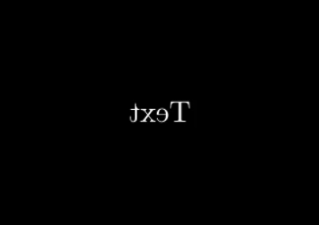

### 2.6 播放动画

#### 2.6.1 **`play()`**

动画效果，可以是多个text，这个函数是多线程的，所以不会阻塞就会进入下一行操作

*（如果下一个操作是remove掉text而没有使用wait函数进行等待，最终效果会变成立即销毁text即没有显示text，下面的add也同理）*

1. **`play(SomePlayMethod(someObject), run_time=seconds)`** ： 播放某种动画方法

   如果希望并行同时播放多个动画，仅仅是python语法问题，给出如下例子模板：

   ```python
   class concurrent(Scene):
       def construct(self):
           dot1 = Dot()
           dot2 = Dot()
           dot2.shift(UP)
           dot3 = Dot()
           dot3.shift(DOWN)
    
           # 单个动画的演示
           self.play(Write(dot1))
           # 多个动画演示
           self.play(*[
               Transform(i.copy(), j) for i, j in zip([dot1, dot1], [dot2, dot3])
           ]) # 故意使用i,j是为了显示zip的使用
   
           self.wait()
   ```

2. 同时改变某种或多种属性
   ```python
   self.play(
       someObjectX.methodX, functionParamX,
       someObjectX.methodY, functionParamY,
       ...,
       run_time=seconds
   )
   ```

   ```python
   class ChangeColorAndSizeAnimation(Scene):
       def construct(self):
           text = TextMobject("Text")
           text.scale(2)
           text.shift(LEFT*2)
           self.play(Write(text))
           self.wait()
           self.play(
               text.shift, RIGHT*2,
               text.scale, 2,
               text.set_color, RED,
               run_time=2
           )
            self.wait()
   ```


##### 2.6.1.1 显示动画函数SomePlayMethods

动画函数，主要包含下列几个：

+ `manimlib\animation\fading.py`：渐变效果 
  
    **`FadeXXX(someObject)`**
    
    + 包含`FadeIn`，`FadeInFromDown`，`FadeOutAndShiftDown`，`FadeInFromPoint`，`FadeInFromLarge`等等
    + 解释：fade in/out 渐入/出；shift down 垂直下降
    
+ `manimlib\animation\creation.py`：生成效果
  
  **`ShowCreation(someObject)`**
  
  + 无法清楚表达，具体可以自行尝试看效果
  
  **`UnCreate(someObject)`**
  
  + 倒放ShowCreation动画效果
  
  **`DrawBorderThenFill(someObject)`**
  
  + 画出边界然后填充
  
  **`Write(someObject)`**
  
  - 继承自DrawBorderThenFill，增加从左往右逐渐显示的效果
  
+ `manimlib\animation\transform.py`从一个渐变成另一个

    + **`Transform(someObject1, someObject2)`**
    + **`ReplacementTransform(someObject1, someObject2)`**

    两者的异同：

    **共同点** : 显示特效相同

    **不同点** : **`Transform`** 显示在画布上的object永远是someObject1

    伪代码：

    ```python
    Transform(someObject1, someObject2):
    	show someObject1 on screen
    	show the transform course of someObject1 to someObject2
    	someObject1 = someObject2
    	show updated someObject1 on screen
    ```

    **`ReplacementTransform`** 显示在画布上的从someObject1变成了someObject2

    伪代码：

    ```python
    ReplacementTransform(someObject1, someObject2):
    	show someObject1 on screen
    	show the transform course of someObject1 to someObject2
    	someObject1 = someObject2
    	show someObject2 on screen	# 不同点在此
        remove someObject1 from screen # 不是从内存删除，仅仅不可见
    ```

    用两段代码来看看效果：

    ```python
    class TextArray(Scene):
        def construct(self):
            text = TextMobject("tex1", "text2", "text3")
            text[0].shift(2 * LEFT)
            text[0].set_color(RED)
            text[1].shift(LEFT)
            text[1].set_color(BLUE)
            self.play(Write(text[0]))
            self.wait(2)
            # 显示的还是text[0]只是text[0]值变成了text[1]
            self.play(Transform(text[0], text[1]))
            # 此时没有让text[0]消失，但让text[1]显现并转换为text[2]
            # 最终text[0]的值为初始text[1]的值，text[1]的值为初始text[2]的值
            self.play(Transform(text[1], text[2]))
            # 最终屏幕上显示的是text[0]和text[1]
            self.wait(3)
    ```

    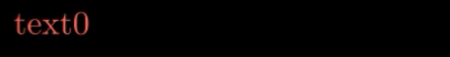

    

    

    将上面的替换成`ReplacementTransform`：

    ```python
    class TextArray(Scene):
        def construct(self):
            text = TextMobject("tex1", "text2", "text3")
            text[0].shift(2 * LEFT)
            text[0].set_color(RED)
            text[1].shift(LEFT)
            text[1].set_color(BLUE)
            self.play(Write(text[0]))
            self.wait(2)
            # 显示的是text[1]但是text[0]值也变成了text[1]，text[0]消失
            self.play(ReplacementTransform(text[0], text[1]))
            # 显示text[2],text[1]值也变成了text[2]，text[1]消失
            # 最终text[0]的值为初始text[1]的值，text[1]的值为初始text[2]的值
            self.play(ReplacementTransform(text[1], text[2]))
            # 最终显示的是text[2]
            self.wait(3)
    ```

    最后一幅图不一样：

    

    **如果希望不要改变someObject1的值可以使用：`someObject1.copy()`进行深度拷贝**

    `someObject1.copy()`执行的伪代码：

    ```python
    someObject1.copy():
        new object
    	object.allValue = self.allValue
    	return object
    ```

+ **`MoveToTarget(someObject):`**
  
  仅对自身产生变化
  
  比较简单，用示例代码即可以看懂：
  
  ```python
  class ChangeColorAndSizeAnimation(Scene):
      def construct(self):
          text = TextMobject("Text")
          self.play(Write(text))
  
          text.generate_target()
          text.target = TextMobject("Target")
          text.target.set_color(RED)
          text.target.scale(2)
          text.target.shift(LEFT)
  
          self.play(MoveToTarget(text), run_time=2)
          self.wait()
  ```

+ `manimlib\animation\growing.py`

  + **`GrowFromXXX(someObject)`**

    `GrowFromCenter`,`GrowFromPoint`,`GrowFromEdge`,`GrowArrow`等等

+ `manimlib\animation\update.py`

  + **`UpdateFromFunc(obj,update_function)`**

    同步播放,很好理解，见例子：

    更多同步并发的播放见**2.9**

    ```python
    class Updater(Scene):
        def construct(self):
            dot = Dot()
            text = TextMobject("Label").next_to(dot, RIGHT, buff=SMALL_BUFF)
    
            self.add(dot, text)
    
            def update_text(obj):
                obj.next_to(dot, RIGHT, buff=SMALL_BUFF)
    
            # Only works in play
            self.play(
                dot.shift, UP * 2,
                UpdateFromFunc(text, update_text)
            )
    
            self.wait()
    ```

    

##### 2.6.1.2 `run_time`

动画从开始到结束所用的时间，决定了**动画的总时长** （如果动画后不加`wait`，可能会出现丢掉结尾的帧的情况）

#### 2.6.1.3 `rate_func`

直译为速度函数，即内定的动画函数

分为三个值： **`there_and_back`来回，`linear`线性变化，`smooth`平滑** （速度先为0，然后加快，到了中间减速最后到达终点为0）

例：

```python
 self.play(
     triangle.shift, RIGHT * 2,
     rate_func=smooth, # Change this with: linear,smooth
     run_time=5
)
```

#### 2.6.2 `add()`

**`self.add(someObject1, someObject2, ...)`**

无动画添加文字，可以是多个text

#### 2.6.3 `wait()`

**`self.wait(seconds)`：**

等待动画停留时间，如果没有参数则默认等待到将动画播放完为止

#### 2.6.4 `remove()`

**`self.remove(someObject1, someObject2,…)`：**

移除text，可以是多个text，注意FadeOut类的动画虽然自带消失效果但是该变量还是会停留在内存中

### 2.7 设置颜色

**`someObject.set_color(COLOR)`**

COLOR有哪些见附录的颜色一栏，COLOR本质上是一个字符串所以可以自定义字符串传入：

**`someObject.set_color(string)`**

如：

```python
someObject.set_color("#0000FF")
```

### 2.8 缩放大小

**`someObject.scale(number)`**
```python
class TextArray(Scene):
    def construct(self):
        dot1 = Dot()
        dot1.scale(3)
        dot1.shift(UP)
        dot2 = Dot()
        self.add(dot1, dot2)
        self.wait(3)
```


### 2.9 同步播放动画

TODO：**暂时没有时间理解源码**

让某一个物体（mobject）跟随另一个物体的移动而并行移动（使用其他移动方式，路径）

`manimlib\mobject\mobject.py`

+ **`add_updater(update_function, index=None, call_updater=True)`**

  + `update_function`：更新函数，函数传入一个object对象，函数内部有一系列对该对象和已知的对象进行的一系列操作，可以是lambda表达式

  例子：让一个点在“label”文字右边，随着文字的移动，始终保持在其右侧

```python
# author:TB
class AddUpdater1(Scene):
    def construct(self):
        dot = Dot()
        text = TextMobject("Label")\
               .next_to(dot, RIGHT, buff=SMALL_BUFF)

        self.add(dot, text)

        # Update function 更新函数
        def update_text(obj):
            obj.next_to(dot, RIGHT, buff=SMALL_BUFF)

        # Add update function to the objects
        # 把更新函数加给对象
        text.add_updater(update_text)
        
        # 如果想简洁，lambda表达式如下：
        # text.add_updater(lambda m: m.next_to(dot, RIGHT, buff=SMALL_BUFF))
        # 此时下面的remove_updater(update_text)不能继续使用，需要改为clear_updaters

        # Add the object again 重新加入text
        # 注意这个步骤不能少，否则看不到！！！
        # 即使之前加入过，现在还是要重新加入
        self.add(text)

        self.play(dot.shift, UP * 2)

        # Remove update function
        text.remove_updater(update_text)

        self.wait()
```

+ **`remove_updater(update_function)`** 取消并行播放函数

+ **`clear_updaters(recursive=True)`** 取消所有的并行播放函数

+ **`UpdateFromFunc(Animation)`**

  见**2.6.1.1**,注意这个函数仅在play函数中生效，play结束后就不会继续同步

更多例子（有时间再补充）：[TB的更新函数页面](https://github.com/Elteoremadebeethoven/AnimationsWithManim/blob/master/English/update_successions/update_successions.py)

## 3. text数组

在2中所有的显示方法几乎都可以对数组成立，

如文字串：

```python
class TextArray(Scene):
    def construct(self):
        text = TextMobject("A", "B", "C", "D", "E", "F")
        text[0].set_color(RED)
        text[1].set_color(ORANGE)
        text[2].set_color(YELLOW)
        text[3].set_color(GREEN)
        text[4].set_color(BLUE) #Hexadecimal color
        self.play(Write(text))
        self.wait(2)
```

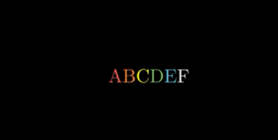

还可以拼接为LaTeX串(此处不能用TextMobject代替，否则报错)：

```python
class TexArray(Scene):
    def construct(self):
        text = TexMobject("A", "{B", "\\over", "C}", "D", "E")
        text[0].set_color(RED)
        text[1].set_color(ORANGE)
        text[2].set_color(YELLOW)
        text[3].set_color(GREEN)
        text[4].set_color(BLUE)
        text[5].set_color(BLUE)
        self.play(Write(text))
        self.wait(2)
```


对于数组可以直接如同对单个object操作,如：

```python
text.shift(UP)
```

**注意：**

**`text = TextMobject(string)`是一维数组**

**当`text = TextMobject(string1，string2，...)`中所有的string均为字母的时候，text为二维数组但是每一个子数组大小仅为1**

**如果有任意一个string是多个字母则text是二维数组**

## 4. 基础动画类 Scene  

所有的动画均是scene类的子类产生的，因此scene的功能比较少，主要是对一些基础的属性进行配置

`manimlib\scene\scene.py`

变量的值得初始定义见下：

```python
# manimlib\scene\scene.py
CONFIG = {
        "camera_class": Camera,
        "camera_config": {},
        "file_writer_config": {},
        "skip_animations": False,
        "always_update_mobjects": False,
        "random_seed": 0,
        "start_at_animation_number": None,
        "end_at_animation_number": None,
        "leave_progress_bars": False,
    }
```

其中 **`camera_config`** 是对视频的处理，由 **`Camera`类** 完成:	

`manimlib\camera\camera.py`

```python
# manimlib\camera\camera.py
CONFIG = {
    # 背景颜色
    "background_image": None,
    # 视频的高宽与帧率
    "pixel_height": DEFAULT_PIXEL_HEIGHT,
    "pixel_width": DEFAULT_PIXEL_WIDTH,
    "frame_rate": DEFAULT_FRAME_RATE,
    # Note: frame height and width will be resized to match
    # the pixel aspect ratio
    # FRAME_HEIGHT = 8.0
    # FRAME_WIDTH = FRAME_HEIGHT * DEFAULT_PIXEL_WIDTH / DEFAULT_PIXEL_HEIGHT
    "frame_height": FRAME_HEIGHT,
    "frame_width": FRAME_WIDTH,
    # 默认方向
    "frame_center": ORIGIN,
    # 背景颜色
    "background_color": BLACK,
    "background_opacity": 1,
    # Points in vectorized mobjects with norm greater
    # than this value will be rescaled.
    "max_allowable_norm": FRAME_WIDTH,
    "image_mode": "RGBA",
    "n_channels": 4,
    "pixel_array_dtype": 'uint8',
    # z_buff_func is only used if the flag above is set to True.
    # round z coordinate to nearest hundredth when comparring
    "z_buff_func": lambda m: np.round(m.get_center()[2], 2),
    "cairo_line_width_multiple": 0.01,
}
```

所有的动画都是继承自`Scene`,所以动画的某些特定的属性可以通过`CONFIG`修改：

例子：

插入背景图片

```python
class TextLike1DArrays(Scene):
    CONFIG={
        "camera_config": {
            "background_image": r"1.png",
        },
    }
    def construct(self):
        self.add(TextMobject("Text").set_color(RED))
        self.wait()
```


## 5. 二维坐标类 GraphScene

`manimlib\scene\graph_scene.py`

继承自`Scene`类，用来绘制坐标

属性如下：

```python
CONFIG = {
        "x_min": -1,
        "x_max": 10,
        "x_axis_width": 9,
        "x_tick_frequency": 1,
        "x_leftmost_tick": None,  # Change if different from x_min
        "x_labeled_nums": None,
        "x_axis_label": "$x$",
        "y_min": -1,
        "y_max": 10,
        "y_axis_height": 6,
        "y_tick_frequency": 1,
        "y_bottom_tick": None,  # Change if different from y_min
        "y_labeled_nums": None,
        "y_axis_label": "$y$",
        "axes_color": GREY,
        "graph_origin": 2.5 * DOWN + 4 * LEFT,
        "exclude_zero_label": True,
        "default_graph_colors": [BLUE, GREEN, YELLOW],
        "default_derivative_color": GREEN,
        "default_input_color": YELLOW,
        "default_riemann_start_color": BLUE,
        "default_riemann_end_color": GREEN,
        "area_opacity": 0.8,
        "num_rects": 50,
    }
```

一般流程是：

```python
class Graph2D(GraphScene):
    def x_2(self, x):
        return x ** 2

    def construct(self):
        self.setup_axes(animate=True)
        graph = self.get_graph(self.x_2, color=GREEN, x_min=2, x_max=4)
        self.play(ShowCreation(graph), run_time=2)
        self.wait()
```


### 5.1 `setup_axes()`

**`setup_axes(animate=Bool)`：**

默认没有动画效果，`setup_axes(animate=True)`则会显示动画 

### 5.2 `get_graph()`

**`get_graph(func, color=None, x_min=None, x_max=None, **kwargs)`**

得到坐标系的句柄，并设置值

### 5.3 `coords_to_point()`

**`coords_to_point(x, y)`**

坐标变成对应的帧中的点，缩写`c2p()`

### 5.4 `point_to_coords()`

**`point_to_coords(point)`**

帧中的点转换为坐标，返回x,y组成的元组，缩写`p2c()`

### 5.5 `get_graph_label()`

**`get_graph_label(graph, label="f(x)", x_val=None, direction=RIGHT, buff=MED_SMALL_BUFF, color=None)`**

`graph`：从graph中获得坐标标签

`label`：默认为“f(x)”,可以改成自己想要的函数

`x_val`：label在坐标系中所处位置的的x坐标

`buff`：距离边界的距离

`color`：颜色

### 5.6 `get_vertical_line_to_graph()`

**`get_vertical_line_to_graph(x, graph, line_class=Line, **line_kwargs)`**

得到竖直线，起点为(x,0)终点为(x,f(x))

返回`line_class`类型的图像

### 5.7 `get_vertical_lines_to_graph()`

**`get_vertical_lines_to_graph(graph, x_min=None, x_max=None, num_lines=20, **kwargs)`**

同时得到画多条竖直线

返回`line_class`类型的`VGroup`

### 5.8 改变坐标标签的颜色

> https://github.com/Elteoremadebeethoven/AnimationsWithManim/blob/master/English/6a_plots_2D/change_label_colors.md#change-labels-colors-in-graphscene
>
> Change labels colors in `GraphScene`
>
> Add this to the `CONFIG` dictionary:在CONFIG中加入：
>
> ```
> "x_label_color": RED,
> "y_label_color": BLUE
> ```
>
> In the `setup_axes` method change the lines：在源码的setup_axes中的两句：
>
> ```
> x_label = TextMobject(self.x_axis_label)
> # and
> y_label = TextMobject(self.y_axis_label)
> ```
>
> with改为
>
> ```
> x_label = TextMobject(self.x_axis_label, color=self.x_label_color)
> # and
> y_label = TextMobject(self.x_axis_label, color=self.y_label_color)
> ```

效果：


## 6. 文本类 `TextMobject`

1.  **`TextMobject(string)`：** 传入一个字符串

   字符串可以是普通字符串或LaTeX格式或两者混合：

   ```python
   TextMobject("This is a regular text")
   ```

   ```python
   TextMobject("\\displaystyle\\frac{x}{y}") # displaystyle使字体能显示正常大小
   ```

   两者混合则需要使用“$$”或者“$”包括：

   ```python
   TextMobject("""
               This is a regular text,
               $\\displaystyle\\frac{x}{y}$,
               $$x^2+y^2=a^2$$
               """)
   ```

   

   自然地，可以用LaTeX调整字体大小：

   ```python
    class SizeTextOnLaTeX(Scene):
       def construct(self):
           textHuge = TextMobject("{\\Huge Huge Text 012.\\#!?} Text")
           texthuge = TextMobject("{\\huge huge Text 012.\\#!?} Text")
           textLARGE = TextMobject("{\\LARGE LARGE Text 012.\\#!?} Text")
           textLarge = TextMobject("{\\Large Large Text 012.\\#!?} Text")
           textlarge = TextMobject("{\\large large Text 012.\\#!?} Text")
           textNormal = TextMobject("{\\normalsize normal Text 012.\\#!?} Text")
           textsmall = TextMobject("{\\small small Text 012.\\#!?} Texto normal")
           textfootnotesize = TextMobject("{\\footnotesize footnotesize Text 012.\\#!?} Text")
           textscriptsize = TextMobject("{\\scriptsize scriptsize Text 012.\\#!?} Text")
           texttiny = TextMobject("{\\tiny tiny Texto 012.\\#!?} Text normal")
           textHuge.to_edge(UP)
           texthuge.next_to(textHuge, DOWN, buff=0.1)
           textLARGE.next_to(texthuge, DOWN, buff=0.1)
           textLarge.next_to(textLARGE, DOWN, buff=0.1)
           textlarge.next_to(textLarge, DOWN, buff=0.1)
           textNormal.next_to(textlarge, DOWN, buff=0.1)
           textsmall.next_to(textNormal, DOWN, buff=0.1)
           textfootnotesize.next_to(textsmall, DOWN, buff=0.1)
           textscriptsize.next_to(textfootnotesize, DOWN, buff=0.1)
           texttiny.next_to(textscriptsize, DOWN, buff=0.1)
           self.add(textHuge, texthuge, textLARGE, textLarge, textlarge, textNormal, textsmall, textfootnotesize, textscriptsize, texttiny)
           self.wait(3)
   ```

   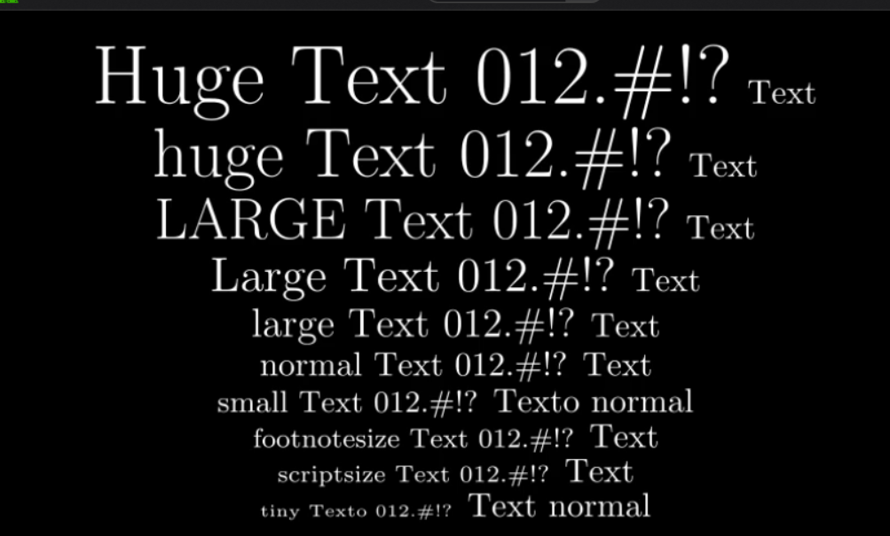

2.  **`TextMobject(string1, string2, string3, ...)`：** 传入多个字符串，返回`TextMobject`数组，可以按照下表索引数组的值

## 7. LaTeX文本类 `TexMobject`

`manimlib\mobject\svg\tex_mobject.py`

显示为LaTeX格式(在想要LaTeX字符串按照数组显示时必须使用这个实现)

```python
CONFIG = {
        "template_tex_file_body": TEMPLATE_TEX_FILE_BODY,
    	# 笔画宽度
        "stroke_width": 0,
    	# 填充不透明度
        "fill_opacity": 1.0,
    	# 笔画的描边宽度
        "background_stroke_width": 1,
    	# 笔画的描边颜色
        "background_stroke_color": BLACK,
        "should_center": True,
        "height": None,
        "organize_left_to_right": False,
        "alignment": "",
    }
```

例：

```python
class Formula(Scene): 
    def construct(self): 
        formula = TexMobject("This is a sentence")
        self.play(Write(formula))
        self.wait(3)
```

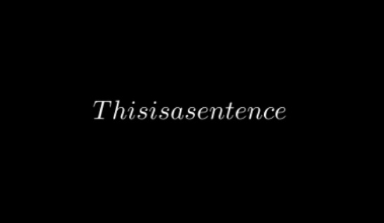

## 8. 二维图形类

`manimlib\mobject\geometry.py`

TODO：待完善

### 8.1 点`Dot`

```python
CONFIG = {
        "radius": DEFAULT_DOT_RADIUS,
        "stroke_width": 0,
        "fill_opacity": 1.0,
        "color": WHITE
    }
```

### 8.2 圆形`Circle`

继承自Arc

```python
CONFIG = {
        "color": RED,
        "close_new_points": True,
        "anchors_span_full_range": False
    }
```

### 8.3 环`Annulus`

继承自圆形

```python
CONFIG = {
        "inner_radius": 1,
        "outer_radius": 2,
        "fill_opacity": 1,
        "stroke_width": 0,
        "color": WHITE,
        "mark_paths_closed": False,
    }
```

### 8.4 长方形`Rectangle`

```python
CONFIG = {
        "color": WHITE,
        "height": 2.0,
        "width": 4.0,
        "mark_paths_closed": True,
        "close_new_points": True,
    }
```

### 8.5 方形`Square`

继承自长方形

```python
 CONFIG = {
     	# 边长
        "side_length": 2.0,
    }
```

### 8.6 椭圆`Ellipse`

继承自圆形

```python
CONFIG = {
        "width": 2,
        "height": 1
    }
```

### 8.7 弧`Arc`

```python
CONFIG = {
        "radius": 1.0,
        "num_components": 9,
        "anchors_span_full_range": True,
        "arc_center": ORIGIN,
    }
```

### 8.8 线`Line`

**`Line(start=LEFT, end=RIGHT, **kwargs)`**

`start,end`:起点终点，形式是np向量

`kwargs`为配置信息，继承自`VMobject`

```python
CONFIG = {
        "fill_color": None,
        "fill_opacity": 0.0,
        "stroke_color": None,
        "stroke_opacity": 1.0,
        "stroke_width": DEFAULT_STROKE_WIDTH,
        # The purpose of background stroke is to have
        # something that won't overlap the fill, e.g.
        # For text against some textured background
        "background_stroke_color": BLACK,
        "background_stroke_opacity": 1.0,
        "background_stroke_width": 0,
        # When a color c is set, there will be a second color
        # computed based on interpolating c to WHITE by with
        # sheen_factor, and the display will gradient to this
        # secondary color in the direction of sheen_direction.
        "sheen_factor": 0.0,
        "sheen_direction": UL,
        # Indicates that it will not be displayed, but
        # that it should count in parent mobject's path
        "close_new_points": False,
        "pre_function_handle_to_anchor_scale_factor": 0.01,
        "make_smooth_after_applying_functions": False,
        "background_image_file": None,
        "shade_in_3d": False,
        # This is within a pixel
        # TODO, do we care about accounting for
        # varying zoom levels?
        "tolerance_for_point_equality": 1e-6,
        "n_points_per_cubic_curve": 4,
    }
```

## 9. 三维图形类

`manimlib\mobject\three_dimensions.py`

### 9.1 球 `Sphere`

继承自`ParametricSurface`,实现通过绘制三维多边形曲面实现的，具体看源码

```python
CONFIG = {
        "resolution": (12, 24),
        "radius": 1,
        "u_min": 0.001,
        "u_max": PI - 0.001,
        "v_min": 0,
        "v_max": TAU,
    }
```

### 9.2 立方 `Cube`

```python
CONFIG = {
        "fill_opacity": 0.75,
        "fill_color": BLUE,
        "stroke_width": 0,
        "side_length": 2,
    }
```

### 9.3 棱柱 `Prism`

继承自`Cube`

```python
CONFIG = {
        "dimensions": [3, 2, 1]
    }
```


### 9.4 参数曲面 `ParametricSurface`

参数方程表达的曲面

**`ParametricSurface(func, **kwargs)`**

```python
 CONFIG = {
        "u_min": 0,
        "u_max": 1,
        "v_min": 0,
        "v_max": 1,
        "resolution": 32,
        "surface_piece_config": {},
        "fill_color": BLUE_D,
        "fill_opacity": 1.0,
        "checkerboard_colors": [BLUE_D, BLUE_E],
        "stroke_color": LIGHT_GREY,
        "stroke_width": 0.5,
        "should_make_jagged": False,
        "pre_function_handle_to_anchor_scale_factor": 0.00001,
    }
```

`func`:自定义的方程，此方程传入两个参数，返回三维向量，每一个分量均是传入两个自变量的表达式

如：

```python
def func(x, y):
    return np.array([x ** 2, y + 2, x ** 2 - y ** 2])
```

绘制三维曲面的例子：

```python
class SurfacesAnimation(ThreeDScene):
    def construct(self):
        axes = ThreeDAxes()
        cylinder = ParametricSurface(
            lambda u, v: np.array([
                np.cos(TAU * v),
                np.sin(TAU * v),
                2 * (1 - u)
            ]),
            resolution=(6, 32)).fade(0.5) #Resolution of the surfaces

        paraboloid = ParametricSurface(
            lambda u, v: np.array([
                np.cos(v) * u,
                np.sin(v) * u,
                u ** 2
            ]), v_max=TAU,
            checkerboard_colors=[PURPLE_D, PURPLE_E],
            resolution=(10, 32)).scale(2)

        para_hyp = ParametricSurface(
            lambda u, v: np.array([
                u,
                v,
                u**2-v**2
            ]), v_min=-2, v_max=2, u_min=-2, u_max=2, checkerboard_colors=[BLUE_D, BLUE_E],
            resolution=(15, 32)).scale(1)

        cone = ParametricSurface(
            lambda u, v: np.array([
                u * np.cos(v),
                u * np.sin(v),
                u
            ]), v_min=0, v_max=TAU, u_min=-2, u_max=2, checkerboard_colors=[GREEN_D, GREEN_E],
            resolution=(15, 32)).scale(1)

        hip_one_side = ParametricSurface(
            lambda u, v: np.array([
                np.cosh(u) *np.cos(v),
                np.cosh(u) * np.sin(v),
                np.sinh(u)
            ]), v_min=0, v_max=TAU, u_min=-2, u_max=2, checkerboard_colors=[YELLOW_D, YELLOW_E],
            resolution=(15, 32))

        ellipsoid=ParametricSurface(
            lambda u, v: np.array([
                1 * np.cos(u) * np.cos(v),
                2 * np.cos(u) * np.sin(v),
                0.5 * np.sin(u)
            ]), v_min=0, v_max=TAU, u_min=-PI/2, u_max=PI/2, checkerboard_colors=[TEAL_D, TEAL_E],
            resolution=(15, 32)).scale(2)

        sphere = ParametricSurface(
            lambda u, v: np.array([
                1.5 * np.cos(u) * np.cos(v),
                1.5 * np.cos(u) * np.sin(v),
                1.5 * np.sin(u)
            ]), v_min=0, v_max=TAU, u_min=-PI/2, u_max=PI/2, checkerboard_colors=[RED_D, RED_E],
            resolution=(15, 32)).scale(2)


        self.set_camera_orientation(phi=75 * DEGREES)
        self.begin_ambient_camera_rotation(rate=0.2)


        self.add(axes)
        self.play(Write(sphere))
        self.wait()
        self.play(ReplacementTransform(sphere, ellipsoid))
        self.wait()
        self.play(ReplacementTransform(ellipsoid, cone))
        self.wait()
        self.play(ReplacementTransform(cone, hip_one_side))
        self.wait()
        self.play(ReplacementTransform(hip_one_side, para_hyp))
        self.wait()
        self.play(ReplacementTransform(para_hyp, paraboloid))
        self.wait()
        self.play(ReplacementTransform(paraboloid, cylinder))
        self.wait()
        self.play(FadeOut(cylinder))
```

### 9.5 参数曲线 `ParametricFunction`

**`ParametricSurface(func, **kwargs)`**

`func`:自定义的方程，此方程传入一个参数，返回三维向量，每一个分量均是传入自变量的表达式

```python
CONFIG = {
        "t_min": 0,
        "t_max": 1,
        "step_size": 0.01,  # Use "auto" (lowercase) for automatic step size
        "dt": 1e-8,
        # TODO, be smarter about figuring these out?
        "discontinuities": [],
    }
```

例：

```python
class ParametricCurve2(ThreeDScene):
    def construct(self):
        curve1=ParametricFunction(
                lambda u: np.array([
                1.2 * np.cos(u),
                1.2 * np.sin(u),
                u / 2
            ]), color=RED, t_min=-TAU, t_max=TAU,
        )
        curve2=ParametricFunction(
                lambda u: np.array([
                1.2 * np.cos(u),
                1.2 * np.sin(u),
                u
            ]), color=RED, t_min=-TAU, t_max=TAU,
        )

        curve1.set_shade_in_3d(True)
        curve2.set_shade_in_3d(True)

        axes = ThreeDAxes()

        self.add(axes)

        self.set_camera_orientation(phi=80 * DEGREES, theta=-60 * DEGREES)
        self.begin_ambient_camera_rotation(rate=0.1) 
        self.play(ShowCreation(curve1))
        self.wait()
        self.play(Transform(curve1, curve2), rate_func=there_and_back, run_time=3)
        self.wait()
```

## 10. 群组类`VGroup`

可以将多个图像合并为一个组进行批量同步操作(自我理解为`Vectorized Group`的缩写)

**`someObjectGroup = VGroup(someObject1, someObject2, ...)`**

### 10.1 `arrange()`

**`someObjectGroup.arrange(DIRECTION, aligned_edge=DIRECTION, buff=number)`**

**`DIRECTION`：** 以someObject1,someObject2,…顺序按照此方向排列

**`aligned_edge`：** 对齐

**`buff`：** 成员之间的距离

例：

```python
class ArrangeObjects(Scene):
    def construct(self):
        text1 = TextMobject("text1")
        text2 = TextMobject("text2 text2")
        text3 = TextMobject("text3 text3 text3")
        textgroup = VGroup(text1, text2, text3)
        textgroup.arrange(
            UP,
            aligned_edge=LEFT,
            buff=0.4
        )
        self.add(textgroup)
        self.wait()
```

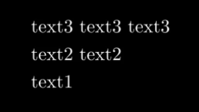

动画效果：

因为`arrange`第一个参数不在`config`里面，需要单独放在外面

```python
self.play(
    text_group.arrange,
    UP,
    {"aligned_edge": RIGHT, "buff": 2}
)
```

## 11. 相机参数

相机是针对3D动画类(**`ThreeDScene`**)的方法

`manimlib\scene\three_d_scene.py`

将视频的视窗看做相机，就可以通过调整相机的远近，角度来观察三维物体，这就是相机类的作用

### 11.1 `set_camera_orientation`

**`threeDScene.set_camera_orientation(phi=degrees1, theta=degrees2, gamma=degrees3, distance=number)`**

设置相机的角度

### 11.2 `move_camera`

**`threeDScene.move_camera(phi=None, theta=None, distance=None, gamma=None, frame_center=None, added_anims=[], **kwargs)`**

例子：

```python
class MoveCamera2(ThreeDScene):
    def construct(self):
        axes = ThreeDAxes()
        circle = Circle()
        self.set_camera_orientation(phi=80 * DEGREES)           
        self.play(ShowCreation(circle), ShowCreation(axes))
        # Start moving camera
        self.begin_ambient_camera_rotation(rate=0.1)            
        self.wait(5)
        # Stop moving camera
        self.stop_ambient_camera_rotation()                     
        # Return the position of the camera
        self.move_camera(phi=80*DEGREES, theta=-PI/2)            
        self.wait()
```

### 11.3 `set_to_default_angled_camera_orientation`

还原为默认角度

### 11.4 `add_fixed_in_frame_mobjects`

加入固定在屏幕的图像，此图像不随相机变化而变化

**`add_fixed_in_frame_mobjects(*mobjects)`**

例：

```python
class Text3D3(ThreeDScene):
    def construct(self):
        axes = ThreeDAxes()
        self.set_camera_orientation(phi=75 * DEGREES, theta=-45 * DEGREES)
        text3d = TextMobject("This is a 3D text")

        self.add_fixed_in_frame_mobjects(text3d) # <----- Add this
        text3d.to_corner(UL)

        self.add(axes)
        self.begin_ambient_camera_rotation()
        self.play(Write(text3d))

        sphere = ParametricSurface(
            lambda u, v: np.array([
                1.5 * np.cos(u) * np.cos(v),
                1.5 * np.cos(u) * np.sin(v),
                1.5 * np.sin(u)
            ]), v_min=0, v_max=TAU, u_min=-PI/2, u_max=PI/2, checkerboard_colors=[RED_D, RED_E],
            resolution=(15, 32)).scale(2)

        self.play(LaggedStartMap(ShowCreation, sphere))
        self.wait(2)
```

## 12. 坐标系类

### 12.0 数轴类 `NumberLine`

继承于`Line`,属性如下：

```python
CONFIG = {
        "color": LIGHT_GREY,
        # X的范围
        "x_min": -FRAME_X_RADIUS,
        "x_max": FRAME_X_RADIUS,
        # 单元格的大小，默认和单位长度一致
        "unit_size": 1,
        # 是否包含刻度tick
        "include_ticks": True,
        # tick的尺寸，大小为：2个单位*tick_size
        "tick_size": 0.1,
        # tick的分布密度
        "tick_frequency": 1,
        # Defaults to value near x_min s.t. 0 is a tick
        # TODO, rename this
        "leftmost_tick": None,
        # Change name
        # 最长的tick,作者原意应该是作为数轴标识的tick,一般为中间的tick即原点，会画长一点
        "numbers_with_elongated_ticks": [0],
        # 标上数字
        "include_numbers": False,
        # 显示的数字格式
        "numbers_to_show": None,
        "longer_tick_multiple": 2,
        # 中间的数字
        "number_at_center": 0,
        "number_scale_val": 0.75,
        "label_direction": DOWN,
        "line_to_number_buff": MED_SMALL_BUFF,
        # 包含箭头
        "include_tip": False,
        # tip:箭头，下面两个是其尺寸设置
        "tip_width": 0.25,
        "tip_height": 0.25,
        "decimal_number_config": {
            "num_decimal_places": 0,
        },
        # 从数字标记中去掉0这个标记
        "exclude_zero_from_default_numbers": False,
    }
```

注意其中`x_min，x_max`均为帧的左右范围即每帧的最左边和最右边

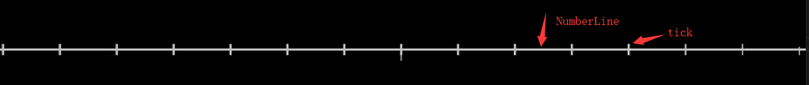

本质上来说，数轴是一条线（Line），每一个间隔（tick）均为小的线(Line)

整个构建流程是，先画出横线作为坐标轴，然后从左到右画出一个个小竖线，最后增加数字，箭头等小部件

### 12.1 坐标系抽象类 `CoordinateSystem`

```python
CONFIG = {
        "dimension": 2,
        "x_min": -FRAME_X_RADIUS,
        "x_max": FRAME_X_RADIUS,
        "y_min": -FRAME_Y_RADIUS,
        "y_max": FRAME_Y_RADIUS,
    }
```

主要的几个抽象方法：

**`coords`指的是坐标轴中的点的值,`point`指没有坐标轴时真实的坐标，在创建坐标轴时候中心设置在ORIGIN，坐标大小没有缩放的时候两者是一样的**

+ `coords_to_point(*coords)；c2p(*coords)`:将坐标系中的点的坐标值转换为屏幕上的点

+ `point_to_coords(point)；p2c(point)`：coords_to_point逆方法

+ `get_axes()`:得到CoordinateSystem对象，一般为包含x,y,z坐标的数组

+ `get_axis(index)`:得到index对应的坐标，xyz坐标对应的index分别为1，2，3

+ `get_x_axis(); get_y_axis(); get_z_axis()`

+ `get_axis_label`一类：给对应的坐标（轴）添加标签，显示标签，并返回标签对象

  + `get_axis_label(label_tex, axis, edge, direction, buff=MED_SMALL_BUFF)`:
  + `get_axis_labels(x_label_tex="x", y_label_tex="y")`：

  + `get_x_axis_label(label_tex, edge=RIGHT, direction=DL, **kwargs)`：

  + `get_y_axis_label(label_tex, edge=UP, direction=DR, **kwargs)`:

  `label_tex`:坐标标签，使用latex字符串(TexMobject)

  `axis`:想获取的坐标标签的对应的坐标对象

  `edge`:四个边缘位置

  `direction`：在坐标轴的相对位置

  `**kwargs`:其他在config内的配置，如颜色等，自行修改

`get_graph(function, **kwargs)`:给定方程，绘制图像并返回

`get_parametric_curve(function, **kwargs)`:绘制给定参数曲线方程并返回

`input_to_graph_point(x, graph)`:暂时没搞清楚啥玩意

### 12.2 二维坐标类 `Axes`

继承`CoordinateSystem`

实质是创造两个NumberLine数轴，然后将其中一个按照中心旋转90度，作为Y轴，然后对X，Y轴进行其他的属性进行调整，所以配置里面有`"number_line_config"`

**`Axes(**kwargs)`**

```python
CONFIG = {
    	# 数轴的配置
        "number_line_config": {
            "color": LIGHT_GREY,
            "include_tip": True,
            "exclude_zero_from_default_numbers": True,
        },
    	# 横坐标轴和数轴的默认配置一样不需要修改
        "x_axis_config": {},
        "y_axis_config": {
            # 默认将“y”这个标签放在纵坐标轴的左侧
            "label_direction": LEFT,
        },
    	# 原点默认和帧图的中心点一致
        "center_point": ORIGIN,
    }
```

实现了：

1. `coords_to_point(*coords)；c2p(*coords)`:将坐标系中的点的坐标值转换为屏幕（帧图）上的点

   分析一下源码：

```python
def coords_to_point(self, *coords):
    # 将坐标轴中的原点0换算为对应的帧图中的坐标
    origin = self.x_axis.number_to_point(0)
    # 将帧图坐标转换为向量
    result = np.array(origin)
    # result = 原点对应的帧图的坐标+coord相对帧图中原点的坐标 = coord在帧图中的实际坐标
    for axis, coord in zip(self.get_axes(), coords):
        result += (axis.number_to_point(coord) - origin)
    return result
```

2. `point_to_coords(point)；p2c(point)`

增加了方法：

`get_coordinate_labels(x_vals=None, y_vals=None)`：传入x,y标签的latex字符串，得到对应的x,y坐标轴的标签的对象

`add_coordinates(x_vals=None, y_vals=None)`:和`get_coordinate_labels`相似，但是将其加入了自己的成员变量并返回了自己

### 12.3 三维坐标系类 `ThreeDAxes`

继承自Axes

**`ThreeDAxes(**kwargs)`**

```python
CONFIG = {
        "dimension": 3,
        "x_min": -5.5,
        "x_max": 5.5,
        "y_min": -5.5,
        "y_max": 5.5,
        "z_axis_config": {},
        "z_min": -3.5,
        "z_max": 3.5,
        "z_normal": DOWN,
        "num_axis_pieces": 20,
        "light_source": 9 * DOWN + 7 * LEFT + 1
    }
```

### 12.4 `NumberPlane`

### 12.5 `ComplexPlane`

复数坐标系，继承于`NumberPlane`

```python
# author:TB
class ComplexPlaneScene(Scene):
    def construct(self):
        # See manimlib/mobject/number_line.py and coordinate_systems.py
        cp = ComplexPlane(
            y_axis_config={"decimal_number_config": {"unit": "i"}},
            number_line_config={"include_numbers": True}
        )
        x_axis = cp[-2]
        y_axis = cp[-1]
        x_axis.set_color(RED)
        y_axis.set_color(PURPLE)
        x_labels = x_axis[1]
        x_labels.set_color(ORANGE)
        y_labels = y_axis[1]
        y_labels.set_color(YELLOW)
        for y in y_labels:
            y.rotate(-PI / 2)
        x_label = TexMobject("x")
        x_label.move_to(cp.c2p(6.8, x_label.get_height()))
        y_label = TexMobject("y")
        y_label.move_to(cp.c2p(-y_label.get_width(), 3.8))
        self.add(cp, x_label, y_label)
        self.wait()
```


## 附录A：常见的常数

`manimlib\constants.py`

### 1. 颜色

见`constants.py`中 **`COLOR_MAP`** 中的列表

具体效果见[TB的教程](https://elteoremadebeethoven.github.io/manim_3feb_docs.github.io/html/_static/colors/colors.html)

### 2. 方向

```python
ORIGIN = np.array((0., 0., 0.))
UP = np.array((0., 1., 0.))
DOWN = np.array((0., -1., 0.))
RIGHT = np.array((1., 0., 0.))
LEFT = np.array((-1., 0., 0.))
IN = np.array((0., 0., -1.))
OUT = np.array((0., 0., 1.))
X_AXIS = np.array((1., 0., 0.))
Y_AXIS = np.array((0., 1., 0.))
Z_AXIS = np.array((0., 0., 1.))
# Useful abbreviations for diagonals
UL = UP + LEFT
UR = UP + RIGHT
DL = DOWN + LEFT
DR = DOWN + RIGHT
TOP = FRAME_Y_RADIUS * UP
BOTTOM = FRAME_Y_RADIUS * DOWN
LEFT_SIDE = FRAME_X_RADIUS * LEFT
RIGHT_SIDE = FRAME_X_RADIUS * RIGHT
```

### 3. 角度

```python
PI = np.pi
TAU = 2 * PI
DEGREES = TAU / 360
```

### 4. 距离

```python
SMALL_BUFF = 0.1
MED_SMALL_BUFF = 0.25
MED_LARGE_BUFF = 0.5
LARGE_BUFF = 1
DEFAULT_MOBJECT_TO_EDGE_BUFFER = MED_LARGE_BUFF
DEFAULT_MOBJECT_TO_MOBJECT_BUFFER = MED_SMALL_BUFF
```
